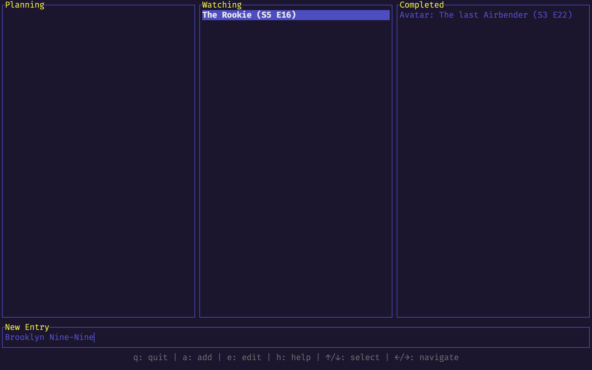

# Senarai: A Terminal Watchlist Manager

Senarai is a lightweight and efficient command-line interface (CLI) application built with Rust, designed to help you manage your personal watchlist directly from your terminal. Whether you're tracking TV shows or any other media, Senarai provides a clean and interactive Terminal User Interface (TUI) to keep tabs on your progress.

## Preview



## Features

* **Interactive UI:** Navigate and manage your watchlist with an intuitive terminal interface.
* **Track Progress:** Easily update the season, episode, and status (Planning, Watching, Completed) of your entries.
* **Configurable Storage:** Define where your watchlist data is stored.

## Installation

To install Senarai, you'll need to have [Rust and Cargo](https://www.rust-lang.org/tools/install) and `make` installed on your system. Once they are set up, you can build and start the app as follows:

```bash
git clone git@github.com:nocheatoriginal/senarai.git
cd senarai
make
```

This command will compile the app and install the `senarai` executable into `target/release`. To run the app, you can use:

```bash
make run
```

Or directly execute the binary:

```bash
./target/release/senarai
```

## Setup and Configuration

Senarai uses a `config.yaml` file for its settings, primarily to define the storage location of your watchlist data. The default configuration located in the root directory of senarai will be copied to `target/release` after using the Makefile.

### config.yaml

The `config.yaml` file should be placed in the same directory as the `senarai` executable. If it's not found, Senarai will use default values.

Here's an example of a `config.yaml` file:

```yaml
storage_path: "~/Desktop/projects/senarai/storage"
```

* `storage_path`: Specifies the directory where your `senarai.db` database file will be stored. If not provided, it defaults to the directory where the `senarai` executable is located.

## Keybindings

Senarai operates in different modes: **Normal**, **Adding**, and **Editing**.

### Normal Mode

| Keybinding          | Action                                            |
| :------------------ | :------------------------------------------------ |
| `q`                 | Quit the application                              |
| `↑`                 | Move selection up                                 |
| `Shift + ↑`         | Move the selected entry up in the list            |
| `↓`                 | Move selection down                               |
| `Shift + ↓`         | Move the selected entry down in the list          |
| `→`                 | Select the next column/status                     |
| `Shift + →`         | Change status of selected entry to next           |
| `←`                 | Select the previous column/status                 |
| `Shift + ←`         | Change status of selected entry to previous       |
| `a`                 | Enter **Adding** mode to add a new entry          |
| `e`                 | Enter **Editing** mode to edit selected entry     |
| `h`                 | Toggle help display                               |
| `t`                 | Toggle full title display                         |
| `+`                 | Increment episode count                           |
| `-`                 | Decrement episode count                           |
| `#`                 | Increment season count                            |
| `x`                 | Remove the selected entry                         |

### Adding / Editing Mode

| Keybinding          | Action                                            |
| :------------------ | :------------------------------------------------ |
| `Enter`             | Confirm and save the new/edited entry             |
| `Esc`               | Exit mode without saving                          |
| `Backspace`         | Delete character                                  |
| `←`                 | Move cursor left                                  |
| `→`                 | Move cursor right                                 |

### Mouse Support

*   **Clicking on an entry:** Selects the entry.
*   **Clicking and dragging an entry:** Moves the entry to a different status column.
*   **Clicking in input area (Adding/Editing mode):** Positions the cursor.
